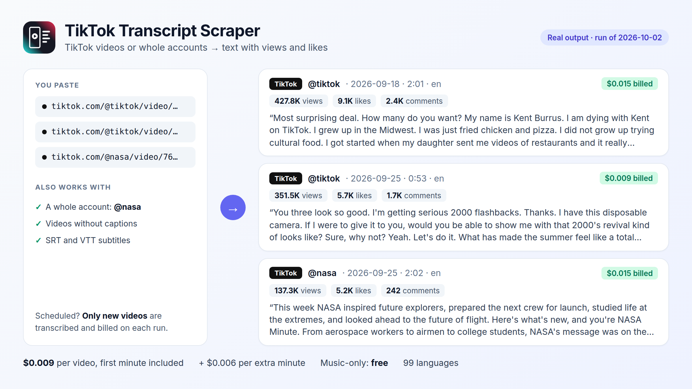

# Data Tools: clean web data for developers and AI agents

Ready-to-run Python examples for pay-per-use [Apify](https://apify.com/fguiraud) Actors that turn **search trends, news, competitor ads, documents, websites, YouTube, TikTok and Instagram videos and audio** into clean JSON, Markdown, CSV and Excel.

🌐 Website: **https://fernandoguiraud16-coder.github.io/data-tools/**

Each example is a single short script plus a `sample-output.json` from a real cloud run, so you can see exactly what you get before running anything.



## Examples

| Example | What it does | Actor |
|---|---|---|
| [google-trends](examples/google-trends) | Compare terms over time, export to CSV, see rising searches and what's trending now | [Google Trends Scraper](https://apify.com/fguiraud/google-trends-scraper) |
| [google-news](examples/google-news) | Save news articles as Markdown files, or get alerts for new stories only | [Google News Scraper](https://apify.com/fguiraud/google-news-scraper) |
| [google-ads-transparency](examples/google-ads-transparency) | Every Google Search, Display and YouTube ad of a competitor, longest-running first, and alerts for new ads | [Google Ads Transparency Scraper](https://apify.com/fguiraud/google-ads-transparency-scraper) |
| [trends-to-news](examples/trends-to-news) | Find the fastest rising searches on a topic and the news that explains them | Trends + News |
| [pdf-to-markdown](examples/pdf-to-markdown) | PDF, Word, Excel, PowerPoint and scans to Markdown, or to RAG chunks in JSONL | [PDF to Markdown Extractor](https://apify.com/fguiraud/document-to-markdown-tables) |
| [pdf-table-extractor](examples/pdf-table-extractor) | Every table in a PDF to an Excel workbook, one sheet per table | [PDF Table Extractor](https://apify.com/fguiraud/pdf-table-extractor) |
| [tech-stack-whois](examples/tech-stack-whois) | Enrich a list of company domains: CMS, email provider, hosting, age, security grade | [Tech Stack Detector & WHOIS](https://apify.com/fguiraud/website-tech-dns-whois-ssl) |
| [bulk-whois](examples/bulk-whois) | Find available and soon-to-expire domains in a list | [Bulk WHOIS Lookup](https://apify.com/fguiraud/bulk-whois-domain-lookup) |
| [audio-transcription](examples/audio-transcription) | Audio or video to text and SRT subtitles, 99 languages | [Audio & Video Transcription](https://apify.com/fguiraud/audio-video-transcriber) |
| [podcast-transcripts](examples/podcast-transcripts) | Transcribe only the new episodes of your favourite podcasts | [Podcast Transcript Scraper](https://apify.com/fguiraud/podcast-transcript-scraper) |
| [youtube-transcripts](examples/youtube-transcripts) | YouTube videos, Shorts, whole channels, playlists and keyword searches to Markdown with timestamps, SRT or text | [YouTube Transcript Scraper](https://apify.com/fguiraud/youtube-transcript-scraper) |
| [Google Hotels guide](https://fernandoguiraud16-coder.github.io/data-tools/guides/google-hotels-api-python/) | Hotel prices per night and total stay for any city and dates, ratings, reviews, amenities; daily price monitor | [Google Hotels Scraper](https://apify.com/fguiraud/google-hotels-scraper) |
| [Google Jobs guide](https://fernandoguiraud16-coder.github.io/data-tools/guides/google-jobs-api-python/) | Job listings from LinkedIn, Indeed and company sites with salary ranges and apply links; alerts for new jobs | [Google Jobs Scraper](https://apify.com/fguiraud/google-jobs-scraper) |
| [mcp-agents](examples/mcp-agents) | Use all of these as tools in Claude, Cursor or any MCP client | Apify MCP server |

Also in the family (same engine as Audio & Video Transcription, so the `audio-transcription` example works with them too):

| Actor | What it does |
|---|---|
| [Instagram Reels Transcript Scraper](https://apify.com/fguiraud/instagram-reels-transcript-scraper) | Instagram Reels to text with author, date, likes and comments ($0.009 per Reel) |
| [TikTok Transcript Scraper](https://apify.com/fguiraud/tiktok-transcript-scraper) | TikTok videos or whole accounts to text with views and likes ($0.009 per video) |
| [Video to Text Transcriber](https://apify.com/fguiraud/video-to-text-transcriber) | TikTok, Instagram, X, Facebook and MP4 links to transcripts and readable subtitles, per minute |
| [SRT Subtitle Generator](https://apify.com/fguiraud/srt-subtitle-generator) | Broadcast-formatted SRT/VTT subtitles (42 characters, 2 lines) |

## For AI agents

- **MCP:** every tool is listed in the [official MCP registry](https://registry.modelcontextprotocol.io) as `io.github.fernandoguiraud16-coder/<tool>` and served at `https://mcp.apify.com/?tools=fguiraud/<tool>`. See [`examples/mcp-agents`](examples/mcp-agents/).
- **Agent skills:** `npx skills add fernandoguiraud16-coder/data-tools` installs [6 skills](skills/) for Claude Code, Codex, Cursor and other coding agents.
- **[llms.txt](llms.txt):** a short index of all tools for LLMs.

## Quick start

1. Create a free Apify account and copy your API token from **Console → Settings → API & Integrations**.
2. Install the client and set the token:

   ```bash
   pip install -r requirements.txt
   export APIFY_TOKEN=your_token          # Windows PowerShell: $env:APIFY_TOKEN="your_token"
   ```

3. Run any example:

   ```bash
   python examples/google-trends/compare_terms.py "chatgpt, gemini, claude" --geo US
   ```

## Pricing

All Actors are **pay per result**: you pay a fraction of a cent per item (term, article, ad, document, domain, video or audio minute), and failed or empty items are not charged. Apify's free plan includes monthly credits, enough to try every example. Exact prices are on each Actor's page.

## Support

Found a bug or need a feature? Open an issue on the Actor's page in the Apify Store (replies within 48 hours), or an issue in this repository for problems with the examples.

## License

The example code is [MIT licensed](LICENSE): copy it into your own projects.
