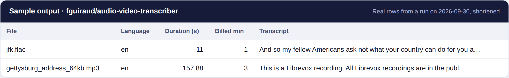

# Transcribe audio and video in Python (Whisper)

Speech to text and SRT/VTT subtitles in 99 languages with the [Audio & Video to Text Transcription](https://apify.com/fguiraud/audio-video-transcriber) Actor. It runs Whisper in the cloud, so you need no GPU and no local install.



```bash
python transcribe.py https://example.com/interview.mp3 --model base --vocabulary "Apify, Kubernetes"
```

Real output from the Actor's daily test:

```text
[ok] jfk.flac: 0.2 min, language en
[ok] gettysburg_address_64kb.mp3: 2.6 min, language en
```

Each file gets a `.txt` transcript and a `.srt` subtitle file in `./transcripts/`.

## Options

- `--model`: `tiny` (fastest), `base` (default) or `small` (most accurate).
- `--task translate`: transcribe any language straight into English.
- `--vocabulary`: names and jargon the model should spell correctly.

Files without speech are not charged. For YouTube or web pages, pass a direct link to the audio or video file.

Full field reference: [`sample-output.json`](sample-output.json) and the [Actor page](https://apify.com/fguiraud/audio-video-transcriber).
