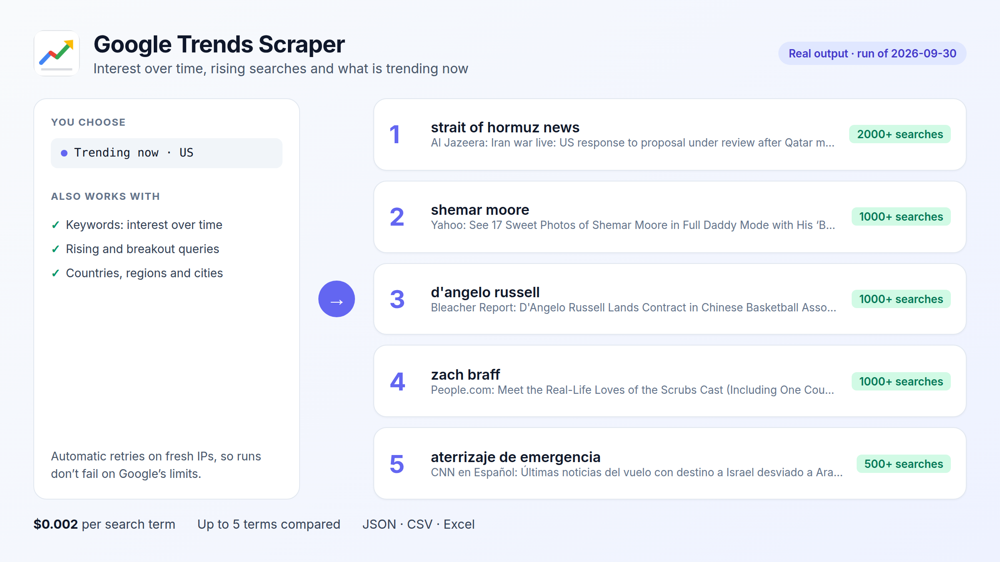

# Google Trends in Python

Get Google Trends data without an unofficial library that breaks: interest over time, by country and city, rising related searches and today's trending searches, through the [Google Trends Scraper](https://apify.com/fguiraud/google-trends-scraper) Actor.



## Compare terms and export to CSV

```bash
python compare_terms.py "chatgpt, gemini, claude" --geo US --timeframe "today 12-m"
```

Real output (September 2026):

```text
Trend summary (US, today 12-m):
  chatgpt      falling  change -21%  peak 2025-10-19
  gemini       rising   change +28%  peak 2026-04-19
  claude       rising   change +228%  peak 2026-05-24

Fastest rising related searches:
  [chatgpt] chatgpt caricature (+3,300%)
  [gemini] gemini spark (+400%)
  [claude] claude cowork (Breakout)

Saved 53 rows to interest_over_time.csv
```

`interest_over_time.csv` has one row per week and one column per term, ready for Excel, pandas or a chart.

## What's trending right now

```bash
python trending_now.py US GB DE
```

## Use cases

- **Content and SEO**: find rising searches in your niche before competitors write about them.
- **Product and market research**: compare brands, products or features over 5 years, by country or city.
- **Weekly reports**: schedule the Actor on Apify and turn on *Monitor new rising searches* to get only what is new.

## Notes

- Values are relative (0-100), where 100 is the peak for the terms compared together.
- Terms with too little search volume return `status: "no-data"` and are **not charged**.
- Full field reference: [`sample-output.json`](sample-output.json) and the [Actor page](https://apify.com/fguiraud/google-trends-scraper).
