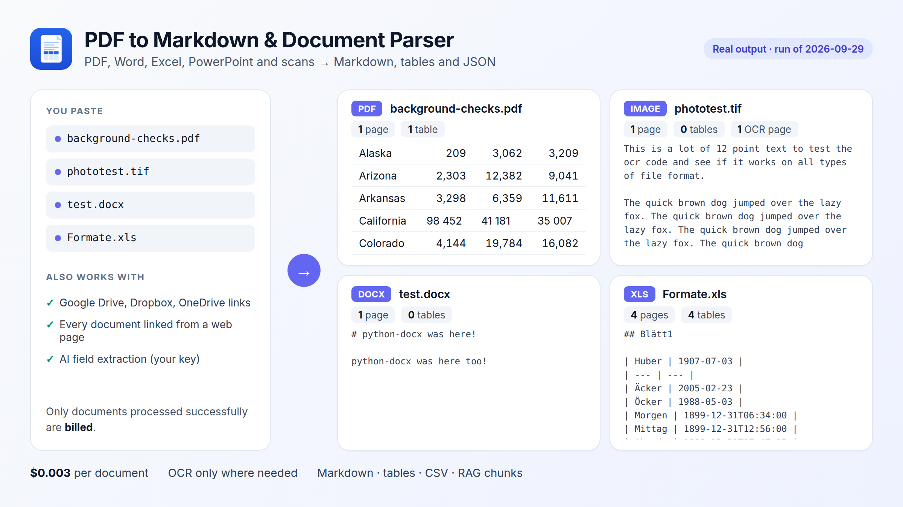

# PDF, Word, Excel and PowerPoint to Markdown in Python

Convert documents into LLM-ready Markdown with real tables, or split them into RAG chunks with page numbers, through the [PDF to Markdown Extractor & Document Parser](https://apify.com/fguiraud/document-to-markdown-tables) Actor. No local dependencies: parsing and OCR run in the cloud.



Supported: PDF (native and scanned), DOCX, XLSX, XLS, PPTX, HTML, CSV and images. Google Drive, Dropbox and OneDrive share links work.

## Convert to Markdown files

```bash
python pdf_to_markdown.py https://example.com/report.pdf https://example.com/slides.pptx
```

Real output from the Actor's daily test:

```text
[ok] background-checks.pdf: 1 pages, 1 tables, 0 OCR pages
[ok] phototest.tif: 1 pages, 0 tables, 1 OCR pages
[ok] test.docx: 1 pages, 0 tables, 0 OCR pages
[ok] Formate.xls: 4 pages, 4 tables, 0 OCR pages
```

## RAG chunks for a vector database

```bash
python rag_chunks.py https://example.com/handbook.pdf --size 1200
```

Writes `chunks.jsonl` with `id`, `text` and `metadata` (source, pageStart, pageEnd): the format Pinecone, Qdrant, Chroma and pgvector loaders expect.

## Why use it

- Two-column papers are read in the right order; repeated headers and footers are removed.
- Tables drawn only with horizontal rules (LaTeX papers) are detected; tables continued on the next page are merged.
- OCR runs only on pages without a text layer, so native PDFs stay fast and cheap.

Full field reference: [`sample-output.json`](sample-output.json) and the [Actor page](https://apify.com/fguiraud/document-to-markdown-tables).
