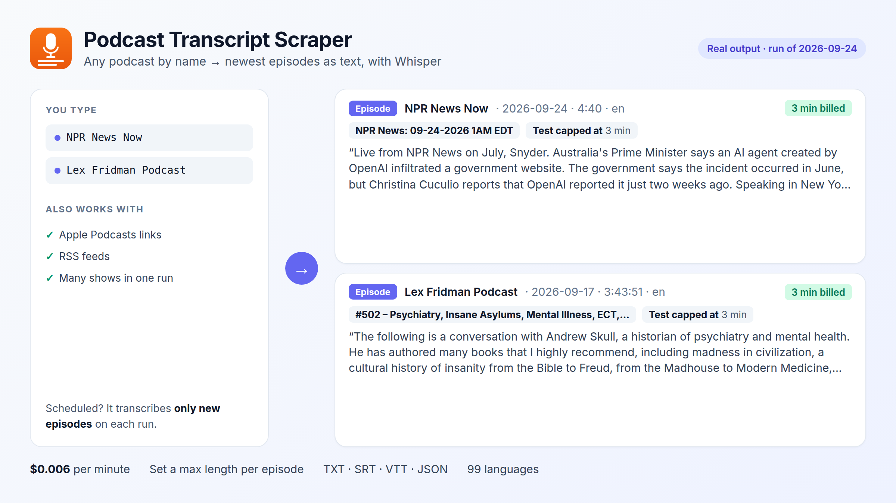

# Podcast transcripts in Python

Transcribe any podcast by **name**, **Apple Podcasts link** or **RSS feed** with the [Podcast Transcript Scraper](https://apify.com/fguiraud/podcast-transcript-scraper) Actor. With `onlyNewEpisodes`, each run transcribes only episodes you haven't processed yet.



```bash
python new_episodes.py "NPR News Now" "https://podcasts.apple.com/us/podcast/lex-fridman-podcast/id1434243584"
```

Real output:

```text
[ok] NPR News Now: NPR News: 09-24-2026 1AM EDT
[ok] Lex Fridman Podcast: #502 – Psychiatry, Insane Asylums, Mental Illness, ECT, Lobo...
```

Each episode is saved as a Markdown file in `./podcasts/`.

## Use cases

- **Newsletters and research**: search and quote what was said across many shows.
- **Content repurposing**: turn episodes into blog posts or social clips with an LLM.
- **Monitoring**: get notified when a show mentions your brand.

Full field reference: [`sample-output.json`](sample-output.json) and the [Actor page](https://apify.com/fguiraud/podcast-transcript-scraper).
